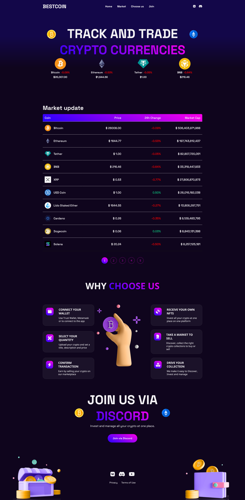
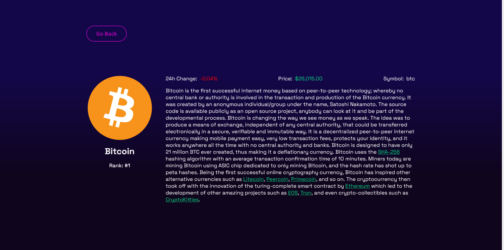

<h1 style="color: white">BESTCOIN</h1>

<h2>About the project</h2>

   
<b>BestCoin</b> is a website that allows users to search for information about various cryptocurrencies in real-time. The website is designed to provide users with accurate and up-to-date information about the price, market cap, trading volume, and other key metrics of cryptocurrencies.  

The website is connected to the Coingecko API, which is a popular source of data for cryptocurrency information. Coingecko provides data on thousands of cryptocurrencies, including their current price, historical price data, trading volume, market cap, and other important metrics. By using this API, the website can provide users with real-time information about the latest cryptocurrency prices and market trends.

<h3>Tags:</h3>

- React JS

- Css modules

- React-router-dom v6

- Node js Express

- API

<h2>Screenshots of the Project 📸</h2>
<h3 align='center'>Home Page 🏡</h3>

<h3 align='center'>Coin Page &#128176</h3>

